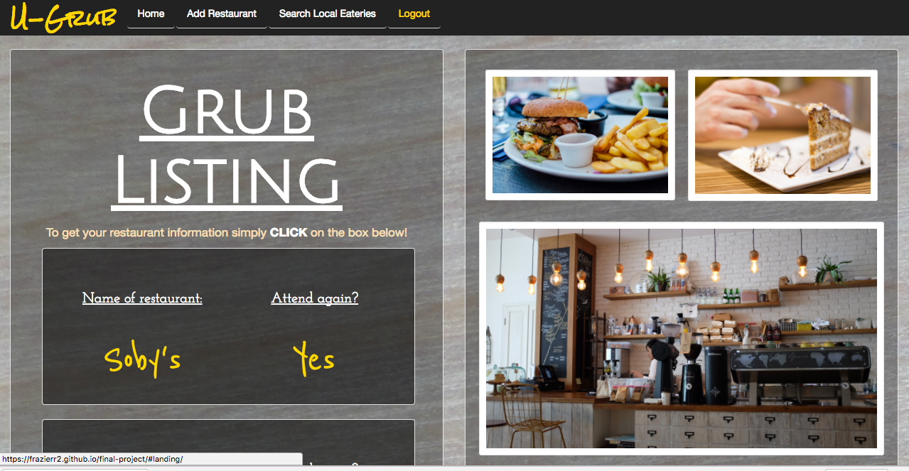

# U-Grub

U-Grub is a web app that allows you to be your own restaurant critic or simply keep track of your restaurant experience. U-Grub also allows you to search for restaurants wherever you are anywhere in the world with a simple push of a button.

> The goal for U-Grub is to allow you, the user, to
> record your restaurant experience and later recall
> the things you liked, didn't like, food you ate and more.
> If you are traveling no worries, we have you covered
> there also. Simply go the the Search Local Eateries tab
> and type in your location and you will be given a list
> of local restaurants with all the information you will
> need to determine the best place to eat.

### Link to U-Grub Web App
which is located [HERE]
>To log into the app and look around and see how it works you can use Username: guest and Password: guest.
>It may take a second or two for the server to boot up once trying to log in. After its up and running things will be able to move around freely.

### Tech Used

During the development of this app I used the following tech:

* [HTML5] - latest version of Hypertext Markup Language, the code that describes web pages
* [CSS3] - latest evolution of the Cascading Style Sheets language
* [Twitter Bootstrap] - great UI boilerplate for modern web apps
* [jQuery] - fast and concise Javascript Library
* [React.js] - declarative, efficient, and flexible JavaScript library for building user interfaces
* [Backbone.js] - light weight Javascript library to structure applications
* [Atom Text Editor] - open-source text and source code editor
* [Dillinger] - Online editor to help with Markdown files

### API's

I used the following API's in the development of U-Grub:
* [Parse Server] for CRUD Development
* Yelp's [Search API] v2 for searching restaurants here and wide

### Some screenshot images of the web app

   [Twitter Bootstrap]: <http://twitter.github.com/bootstrap/>
   [jQuery]: <http://jquery.com>
   [HTML5]: <https://developer.mozilla.org/en-US/docs/Web/Guide/HTML/HTML5>
   [CSS3]: <https://developer.mozilla.org/en-US/docs/Web/CSS/CSS3>
   [React.js]: <https://facebook.github.io/react/>
   [Backbone.js]: <http://backbonejs.org/>
   [Atom Text Editor]: <https://atom.io/>
   [Dillinger]: <http://dillinger.io/>
   [Parse Server]: <http://parse.com/>
   [Search API]: <https://www.yelp.com/developers/documentation/v2/search_api>
   [HERE]: <https://frazierr2.github.io/final-project/>
